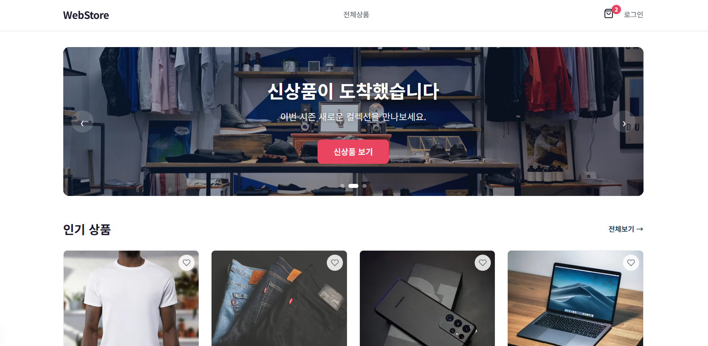
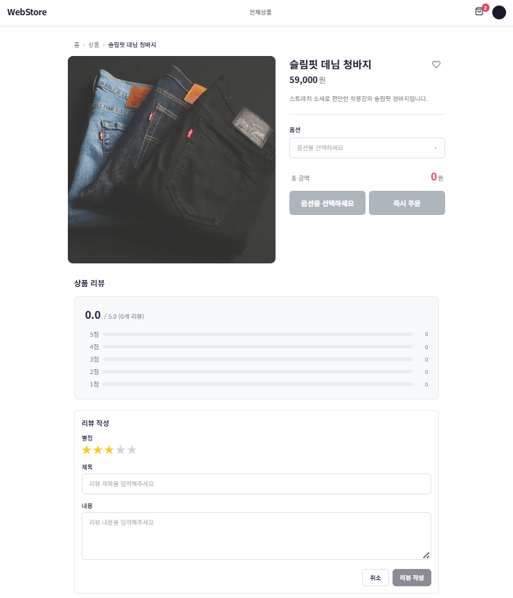
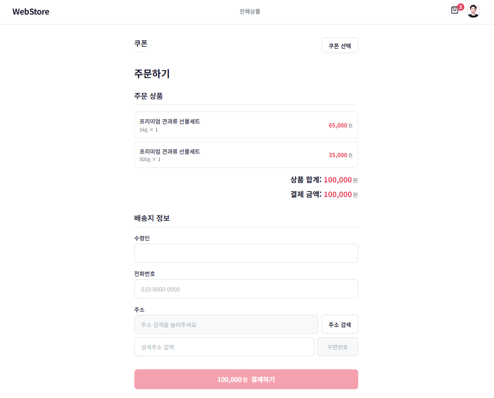
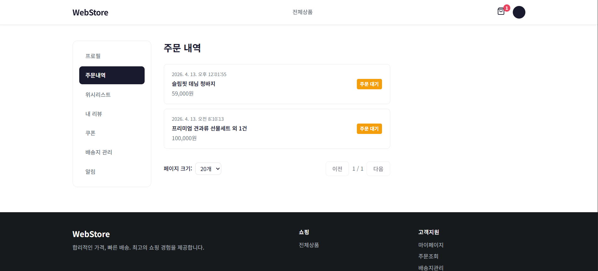
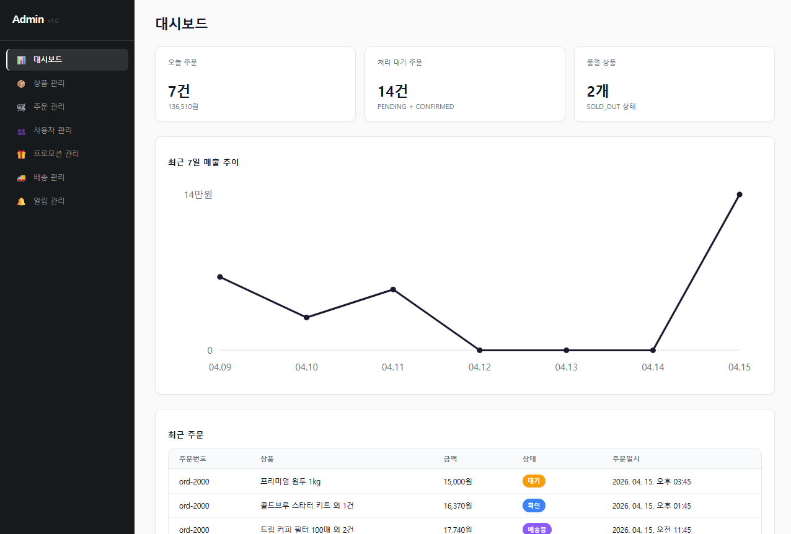
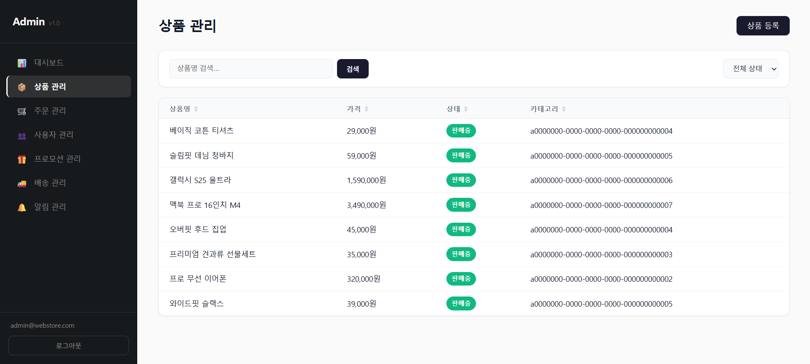
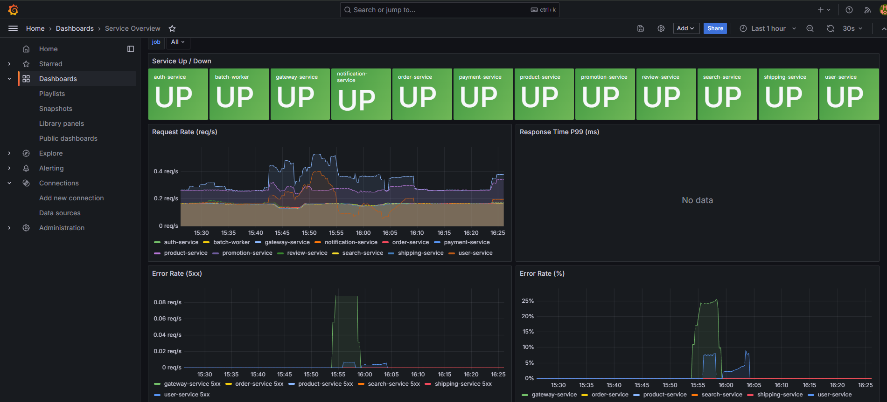

# E-Commerce Microservices Platform

> 도메인 기반 마이크로서비스 아키텍처로 설계된 End-to-End 이커머스 플랫폼


---

## Overview

상품 카탈로그, 주문, 결제, 배송, 리뷰, 알림, 검색, 프로모션을 포함하는 **B2C 이커머스 플랫폼**입니다.

12개의 백엔드 서비스와 2개의 프론트엔드 앱이 **모노레포** 구조로 운영되며, 각 서비스는 도메인 특성에 맞는 서로 다른 아키텍처 패턴을 채택합니다.

### Highlights

- **12 Microservices** — 서비스별 독립 DB, Kafka 기반 비동기 통신
- **다중 아키텍처 패턴** — DDD / Hexagonal / Layered를 서비스 복잡도에 따라 선택 적용
- **Spec-Driven Development** — 스펙 → 태스크 → 구현 → 리뷰 워크플로우
- **Full Observability** — Prometheus + Grafana + Loki + Jaeger 통합 모니터링
- **500+ 테스트** — JUnit 5, Testcontainers, Vitest, React Testing Library
- **K8s Production-Ready** — NetworkPolicy, PDB, ConfigMap 기반 배포 구성

---

## Screenshots

### Web Store (고객)

<p align="center">
  <br>
  <em>상품 카탈로그 — Elasticsearch 기반 검색 · 카테고리 필터</em>
</p>

<p align="center">
  <br>
  <em>상품 상세 — 옵션 선택 · 리뷰 · 위시리스트</em>
</p>

<p align="center">
  <br>
  <em>체크아웃 — 배송지 입력 · Toss Payments 결제 연동</em>
</p>

<p align="center">
  <br>
  <em>주문 내역 — 주문 상태 추적 (PENDING → CONFIRMED → SHIPPED → DELIVERED)</em>
</p>

### Admin Dashboard (관리자)

<p align="center">
  <br>
  <em>관리자 대시보드 — 주요 KPI · 최근 주문</em>
</p>

<p align="center">
  <br>
  <em>상품 관리 — ProductCreated 이벤트 발행 → Search 인덱스 실시간 반영</em>
</p>

### Observability

<p align="center">
  <br>
  <em>Grafana — Prometheus 메트릭 · Loki 로그 · Jaeger 트레이스 통합 뷰</em>
</p>

---

## System Architecture

```
┌─────────────────────────────────────────────────────────────────────┐
│                           Clients                                   │
│                  Web Store (3000)  Admin Dashboard (3001)            │
└──────────────────────────┬──────────────────────────────────────────┘
                           │
                    ┌──────▼──────┐
                    │   Gateway   │  Spring Cloud Gateway
                    │   (8080)    │  JWT Auth / Rate Limit / Routing
                    └──────┬──────┘
                           │
          ┌────────────────┼────────────────────────────┐
          │                │                             │
   ┌──────▼──────┐ ┌──────▼──────┐ ┌──────▼──────┐     │
   │    Auth     │ │   Product   │ │    Order    │     ...
   │   (8081)    │ │   (8082)    │ │   (8086)    │
   │  Layered    │ │    DDD      │ │    DDD      │
   └──────┬──────┘ └──────┬──────┘ └──────┬──────┘
          │                │                │
          └────────────────┼────────────────┘
                           │
              ┌────────────▼────────────┐
              │     Apache Kafka        │
              │   Event Bus / Outbox    │
              └────────────┬────────────┘
                           │
          ┌────────────────┼────────────────┐
          │                │                 │
   ┌──────▼──────┐ ┌──────▼──────┐ ┌───────▼─────┐
   │  Payment    │ │   Search    │ │ Notification │
   │  (8087)     │ │   (8085)    │ │   (8093)     │
   │ Hexagonal   │ │ Hexagonal   │ │  Hexagonal   │
   └─────────────┘ └─────────────┘ └──────────────┘
```

---

## Services

### Backend (Spring Boot 3.4 / Java 21)

| Service | Port | Architecture | 역할 | 핵심 패턴 |
|---------|------|-------------|------|-----------|
| **Gateway** | 8080 | Layered | API 라우팅, 인증, Rate Limiting | Spring Cloud Gateway, Redis |
| **Auth** | 8081 | Layered | 회원가입, JWT 인증, 세션 관리 | JWT, Redis Session |
| **Product** | 8082 | DDD | 상품 카탈로그, 재고 관리 | Aggregate, Domain Events |
| **User** | 8084 | Layered | 프로필, 주소, 위시리스트 | CRUD, Preferences |
| **Search** | 8085 | Hexagonal | 상품 검색, 필터링 | Elasticsearch, Event Indexing |
| **Order** | 8086 | DDD | 주문 생성, 상태 추적, 취소 | Saga, Outbox Pattern |
| **Payment** | 8087 | Hexagonal | 결제 승인, 환불 | Toss Payments, Port/Adapter |
| **Batch Worker** | 8088 | Layered | 배치 작업, 데이터 집계 | Spring Batch, Scheduling |
| **Shipping** | 8090 | Layered | 배송 추적, 상태 관리 | Outbox Pattern |
| **Review** | 8091 | Layered | 상품 리뷰, 평점 | Cross-service REST |
| **Promotion** | 8092 | DDD | 프로모션, 쿠폰 | Outbox Pattern |
| **Notification** | 8093 | Hexagonal | 알림 (Email/SMS/Push) | Multi-channel, Event Consumer |

### Frontend (Next.js 15 / React 19 / TypeScript)

| App | Port | Architecture | 역할 |
|-----|------|-------------|------|
| **Web Store** | 3000 | Feature-Sliced Design | 고객 쇼핑 (검색, 장바구니, 주문, 결제) |
| **Admin Dashboard** | 3001 | Feature-based Layered | 관리자 (상품/주문/프로모션/알림 관리) |

---

## Architecture Decision: 서비스별 다른 패턴을 쓰는 이유

모든 서비스에 동일한 아키텍처를 강제하지 않습니다. **도메인 복잡도에 따라 적합한 패턴을 선택**합니다.

| 패턴 | 적용 기준 | 적용 서비스 |
|------|----------|------------|
| **DDD** | 복잡한 비즈니스 규칙, Aggregate 일관성 필요 | Order, Product, Promotion |
| **Hexagonal** | 외부 시스템 연동이 핵심, 교체 가능성 높음 | Payment, Search, Notification |
| **Layered** | 비교적 단순한 CRUD, 빠른 구현 우선 | Auth, User, Shipping, Review, Batch |

---

## Tech Stack

### Backend
- **Framework**: Spring Boot 3.4.1, Spring Cloud 2024.0.0
- **Language**: Java 21
- **Database**: PostgreSQL 16 (Database-per-Service)
- **Messaging**: Apache Kafka 3.7 + Outbox Pattern
- **Cache**: Redis 7 (세션, Rate Limiting)
- **Search**: Elasticsearch 8.15
- **Build**: Gradle (멀티모듈)

### Frontend
- **Framework**: Next.js 15, React 19
- **Language**: TypeScript 5.5
- **State**: TanStack React Query 5
- **Payment**: Toss Payments SDK
- **Build**: Turbo + pnpm Workspaces

### Shared Libraries
| Library | 역할 |
|---------|------|
| `java-common` | 공통 유틸리티 |
| `java-web` | HTTP 예외 처리, Jackson 설정 |
| `java-messaging` | Kafka + Outbox Pattern 구현 |
| `java-observability` | Actuator + Micrometer + OpenTelemetry |
| `java-security` | 인증/보안 유틸리티 |
| `java-test-support` | 테스트 공통 지원 |
| `@repo/api-client` | Axios 기반 API 클라이언트 |
| `@repo/types` | 공유 TypeScript 타입 |
| `@repo/ui` | 공유 UI 컴포넌트 |

### Infrastructure & Observability
| Component | 역할 |
|-----------|------|
| **Spring Cloud Gateway** | API 라우팅, JWT 필터, Rate Limiting |
| **Prometheus** | 메트릭 수집 (15s 주기) |
| **Grafana** | 대시보드, 시각화 |
| **Loki + Promtail** | 로그 수집 및 검색 |
| **Jaeger** | 분산 트레이싱 (OpenTelemetry) |
| **AlertManager** | 알림 라우팅 |

---

## Event-Driven Architecture

서비스 간 통신은 **Kafka 이벤트**로 이루어지며, 트랜잭션 일관성을 위해 **Outbox Pattern**을 적용합니다.

```
Order Service                  Kafka                    Downstream
┌──────────┐              ┌──────────┐
│ 주문 생성  │──TX──▶│  Outbox  │──Relay──▶ OrderPlaced ──▶ Payment Service
│ + Outbox  │              │  Table   │                    ──▶ Notification Service
└──────────┘              └──────────┘                    ──▶ Search Service
```

### 주요 도메인 이벤트

| 도메인 | 이벤트 |
|--------|--------|
| Auth | UserSignedUp, LoginFailed, SessionLimitExceeded |
| Order | OrderPlaced, OrderConfirmed, OrderCancelled |
| Payment | PaymentCompleted, PaymentFailed, RefundInitiated |
| Product | ProductCreated, ProductUpdated, StockChanged |
| Shipping | ShippingStatusChanged |
| Promotion | CouponIssued, PromotionActivated |

---

## Testing

| 레이어 | 도구 | 범위 |
|--------|------|------|
| **Unit / Integration** | JUnit 5, Testcontainers | 백엔드 서비스 로직, DB 통합 |
| **Contract** | Custom Contract Tests | API 계약 검증 |
| **Component** | Vitest, React Testing Library | 프론트엔드 컴포넌트 |
| **Load** | k6 | 성능 (P95 < 500ms, Error < 1%) |

### Load Test Scenarios (k6)

| 시나리오 | 내용 | VU (Stress) |
|----------|------|-------------|
| Auth | 로그인, 회원가입, 토큰 갱신 | ~150 |
| Search | 상품 검색, 필터링 | ~150 |
| Order | 주문 생성, 조회, 취소 | ~150 |
| Payment | 결제 처리 | ~150 |
| **E2E Flow** | 회원가입→검색→주문→결제 | ~150 |

### Performance 측정 결과 (Search 시나리오, 단일 호스트 Docker)

| Endpoint | Median | P95 | 검증 통과율 |
|----------|--------|-----|------------|
| Product List | **25ms** | 657ms | 99.8% |
| Product Detail | **18ms** | 471ms | 99.8% |
| Search | **78ms** | 15.1s* | 72%* |

\* Stress 단계(150 VUs)에서 Elasticsearch saturation. Smoke/Load 구간은 SLA 부합.

상세 분석: [docs/performance-benchmark.md](docs/performance-benchmark.md)

---

## API Documentation (Swagger/OpenAPI)

각 서비스는 SpringDoc 기반 OpenAPI 3.0 스펙을 자동 생성하고 Swagger UI를 제공합니다.

| Service | Swagger UI | OpenAPI JSON |
|---------|-----------|--------------|
| Product | http://localhost:8082/swagger-ui.html | http://localhost:8082/v3/api-docs |
| Auth    | http://localhost:8081/swagger-ui.html | http://localhost:8081/v3/api-docs |
| User    | http://localhost:8084/swagger-ui.html | http://localhost:8084/v3/api-docs |
| Order   | http://localhost:8086/swagger-ui.html | http://localhost:8086/v3/api-docs |
| Payment | http://localhost:8087/swagger-ui.html | http://localhost:8087/v3/api-docs |

- 컨트롤러의 @RestController + DTO에서 스키마/예시 자동 추론
- `/v3/api-docs` JSON 출력을 Postman/Insomnia 등으로 import 가능
- 전체 계약은 여전히 `specs/contracts/http/*.md` 가 source of truth

---

## Deployment

### Local (Docker Compose)

```bash
# 전체 서비스 실행
docker-compose up --build -d

# 프론트엔드만 개발 모드
pnpm dev
```

### Production (Kubernetes)

```
k8s/
├── base/               # Namespace, Secrets
├── services/           # 10 Service Deployments (ConfigMap, PDB, Service)
├── network-policies/   # Default-Deny + 서비스별 허용 정책
├── ingress/            # Gateway Ingress + Security Headers
└── external/           # Infrastructure (DB, Kafka, Redis, ES)
```

- **PodDisruptionBudget** — 롤링 업데이트 시 가용성 보장
- **NetworkPolicy** — Default-Deny + 명시적 허용 (Zero Trust)
- **ConfigMap** — 환경별 설정 분리

### CI/CD (GitHub Actions)

- **Backend CI** — 변경 감지 기반 서비스별 빌드/테스트
- **Frontend CI** — Turbo 기반 Lint, Type Check, Test
- **Docker Build** — 이미지 빌드 자동화

---

## Project Structure

```
first-project/
├── apps/
│   ├── gateway-service/        # API Gateway (Spring Cloud Gateway)
│   ├── auth-service/           # 인증 서비스
│   ├── product-service/        # 상품 서비스
│   ├── order-service/          # 주문 서비스
│   ├── payment-service/        # 결제 서비스
│   ├── user-service/           # 사용자 서비스
│   ├── search-service/         # 검색 서비스
│   ├── shipping-service/       # 배송 서비스
│   ├── review-service/         # 리뷰 서비스
│   ├── promotion-service/      # 프로모션 서비스
│   ├── notification-service/   # 알림 서비스
│   ├── batch-worker/           # 배치 처리
│   ├── web-store/              # 고객 웹 (Next.js)
│   └── admin-dashboard/        # 관리자 대시보드 (Next.js)
├── libs/                       # 공유 라이브러리 (Java)
├── packages/                   # 공유 패키지 (TypeScript)
├── specs/                      # 스펙 문서 (Source of Truth)
│   ├── contracts/              # API & Event 계약
│   ├── services/               # 서비스별 아키텍처 정의
│   ├── features/               # 기능 스펙
│   └── use-cases/              # 유스케이스
├── k8s/                        # Kubernetes 매니페스트
├── infra/                      # 모니터링 스택 설정
├── load-tests/                 # k6 부하 테스트
├── tasks/                      # 태스크 라이프사이클 관리
└── docker-compose.yml          # 로컬 개발 환경
```

---

## Development Methodology

이 프로젝트는 **Spec-Driven, Task-Driven** 방식으로 개발되었습니다.

### Workflow

```
Spec 작성 → Task 생성 → Ready → In-Progress → Review → Done
```

1. **Spec First** — 구현 전 스펙 문서를 먼저 작성 (`specs/`)
2. **Contract First** — API/Event 계약 정의 후 구현 (`specs/contracts/`)
3. **Task Lifecycle** — `backlog → ready → in-progress → review → done → archive`
4. **Architecture per Service** — 각 서비스의 아키텍처는 `specs/services/<service>/architecture.md`에 선언

### Taxonomy-Based Rule System

프로젝트의 도메인과 특성(trait)에 따라 적용할 규칙이 자동으로 결정됩니다.

```yaml
# PROJECT.md
domain: ecommerce
traits: [transactional, content-heavy, read-heavy, integration-heavy]
```

- `transactional` → Saga, Idempotency, Outbox Pattern 규칙 활성화
- `content-heavy` → 캐시, CDN, 검색 최적화 규칙 활성화
- `read-heavy` → 읽기 복제, 페이지네이션 규칙 활성화
- `integration-heavy` → Circuit Breaker, Retry, DLQ 규칙 활성화

---

## Key Business Flows

### 주문 → 결제 → 배송 (Saga)

```
Customer         Order          Payment        Shipping       Notification
   │                │               │               │               │
   │── 주문 생성 ──▶│               │               │               │
   │                │── OrderPlaced ▶               │               │
   │                │               │── 결제 요청 ──▶               │
   │                │               │               │               │
   │                │◀─ PaymentCompleted ──┤         │               │
   │                │── OrderConfirmed ───────────▶│               │
   │                │               │               │── 배송 시작 ──▶│
   │                │               │               │               │── 알림 발송
   │◀────────────── 주문 완료 ──────────────────────────────────────┤
```

### 상품 → 검색 인덱스 (Event-Driven)

```
Admin            Product          Kafka           Search
  │                 │                │               │
  │── 상품 등록 ──▶│                │               │
  │                 │── ProductCreated ▶             │
  │                 │                │── Index ────▶│
  │                 │                │               │── ES 반영
```

---

## Documentation

| 문서 | 내용 |
|------|------|
| [Architecture Diagrams](docs/architecture-diagrams.md) | Mermaid 기반 시스템 아키텍처, 이벤트 흐름, 인프라 구성도 |
| [Demo Scenarios](docs/demo-scenarios.md) | 주요 비즈니스 흐름별 데모 시나리오 (화면 + API 매핑) |
| [Development Process](docs/development-process.md) | 개발 방법론, 기술적 의사결정, 차별점 상세 |
